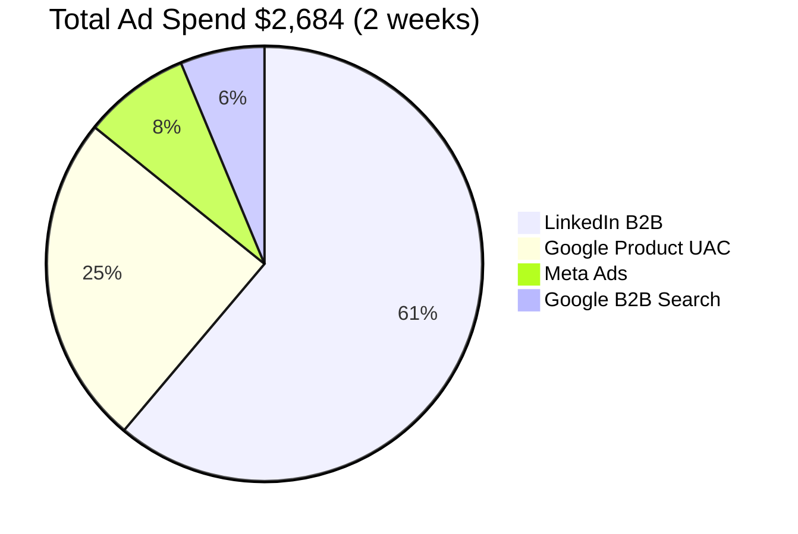
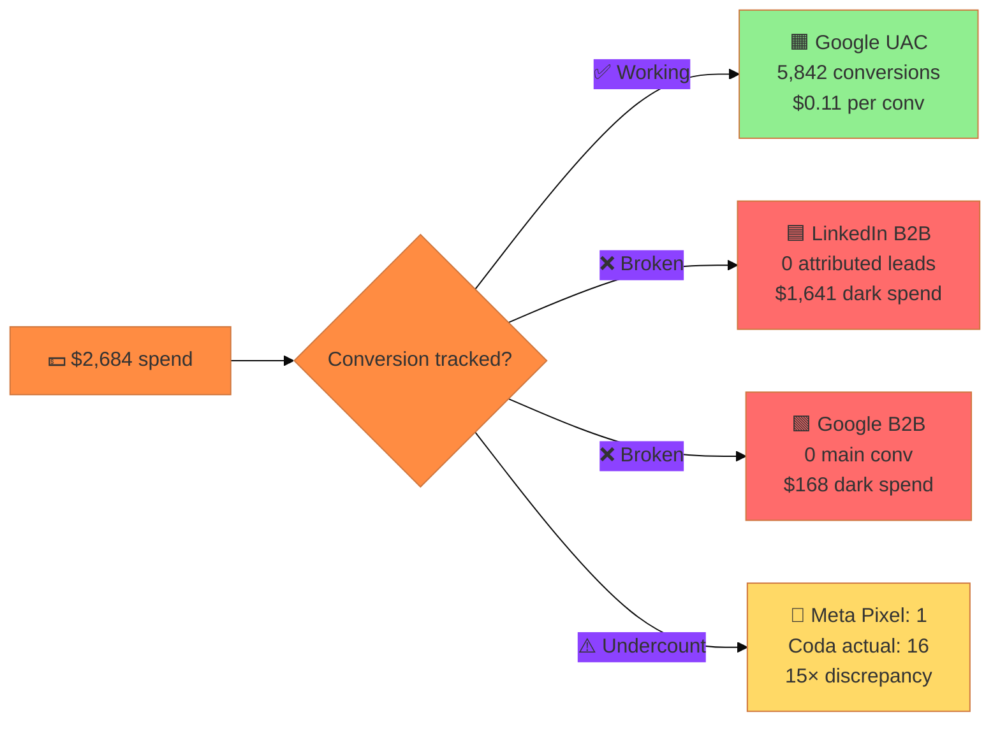
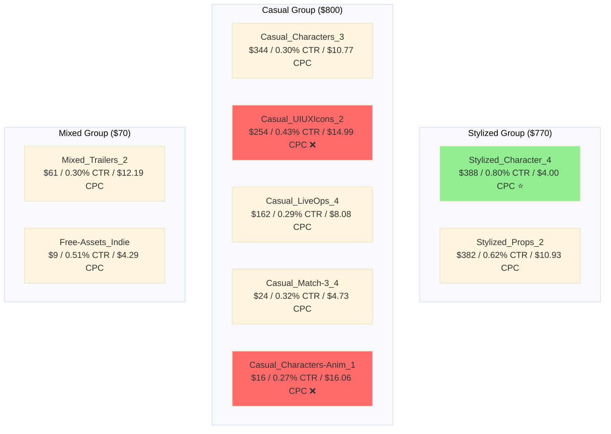
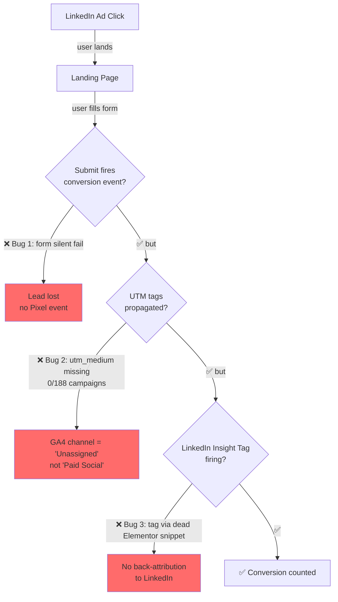
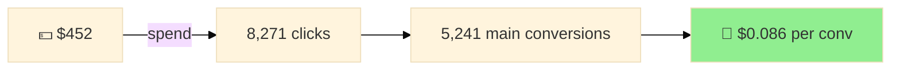
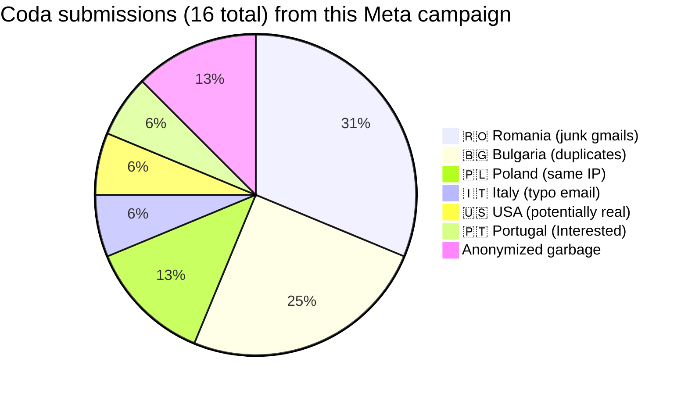
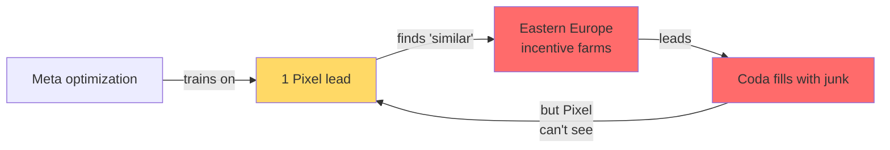
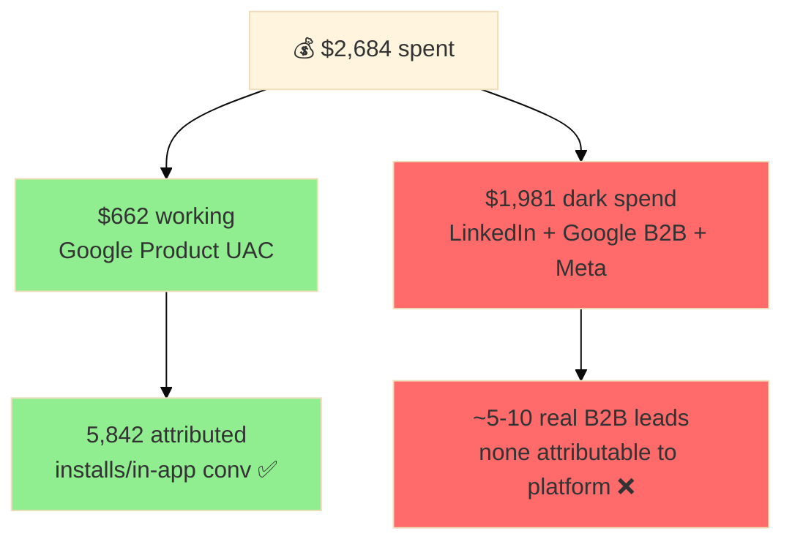

# 📺 Paid Ads Report — RetroStyle Games

**Window:** May 1 → May 15, 2026 (2 weeks)
**Generated:** 2026-05-15

---

## 💰 Spend distribution



| Platform | Spend | Share | Active Campaigns |
|---|---:|---:|---:|
| 🟦 **LinkedIn B2B** | $1,641 | **61%** | 9 |
| 🟧 **Google Product (UAC)** | $662 | 25% | 2 |
| 🔵 **Meta Ads** | $213 | 8% | 1 |
| 🟩 **Google B2B (Search)** | $168 | 6% | 1 |
| **TOTAL** | **$2,684** | 100% | 13 |

---

## ⚡ Conversion reality check



### Verdict

| Channel | $ spent | Tracked conv | Reality |
|---|---:|---:|---|
| 🟧 Last Pirate UAC | $452 | **5,241** ✅ | Truth — Firebase events firing clean |
| 🟧 Uncharted Tier 1 UAC (paused) | $210 | 601 ✅ | Truth — paused mid-window |
| 🟦 LinkedIn (9 campaigns) | $1,641 | 0 ❌ | UTM + Form submit + Insight Tag — 3 layers broken |
| 🔵 Meta B2B Slots | $213 | 1 vs 16 ⚠️ | Pixel undercounts 15× — Lead event not firing on submit |
| 🟩 Google Playable Ads Search | $168 | 0 ❌ | Same submit-fail bug + multi-LP fragmentation |

---

## 🟦 LinkedIn B2B — Campaign Performance

**Total: $1,641 / 0 attributed leads**



### CPC efficiency leaderboard

```
$/Click (lower = better)

Stylized_Character_4     ████░░░░░░░░░░░░░░░░░░  $4.00  ⭐ BEST
Free-Assets_Indie        ████░░░░░░░░░░░░░░░░░░  $4.29
Casual_Match-3_4         █████░░░░░░░░░░░░░░░░░  $4.73
Casual_LiveOps_4         ████████░░░░░░░░░░░░░░  $8.08
Casual_Characters_3      ██████████░░░░░░░░░░░░  $10.77
Stylized_Props_2         ██████████░░░░░░░░░░░░  $10.93
Mixed_Trailers_2         ████████████░░░░░░░░░░  $12.19
Casual_UIUXIcons_2       ███████████████░░░░░░░  $14.99  ❌ WORST
Casual_Characters-Anim_1 ████████████████░░░░░░  $16.06  ❌ WORST
```

### 🏆 Top concept: **Stylized 3D Characters & Props**
Best CTR (0.80%) + cheapest CPC ($4.00). Production benchmark.

### 🔻 Bottom concepts: **Casual UI/UX + Animation**
$15-16 per click for 0.27-0.43% CTR. Either creative refresh or cut.

### 🚨 Why 0 attributed leads (3 broken layers)



---

## 🟧 Google Ads — Product (UAC) — The Working Engine

**Total: $662 / 5,842 attributed conversions / $0.11 per conv**

| Campaign | Status | Spend | Imp | Clicks | Conv | All Conv |
|---|---|---:|---:|---:|---:|---:|
| 🚀 30.03.2026 LP - in-app | ✅ ENABLED | $452 | 182,459 | 8,271 | **5,241** | 24,619 |
| ⏸ Uncharted Island 23/04 Tier 1 | PAUSED | $210 | 51,220 | 1,707 | 601 | 3,083 |



🎯 **Last Pirate retention machine** — best-in-portfolio efficiency. **Don't touch what works.**

⏸ **Uncharted Tier 1 paused** — was tracking $0.35/conv (still great). Investigate pause reason — creative fatigue? Budget exhaustion? D7 ROAS dip?

---

## 🟩 Google Ads — B2B (Search keywords)

**Total: $168 / 0 main conversions**

| Campaign | Status | Spend | Imp | Clicks | **CTR** | Main Conv | All Conv |
|---|---|---:|---:|---:|---:|---:|---:|
| Playable Ads Search | ENABLED | $168 | 132 | 16 | **12.1%** 🚀 | **0** ❌ | 1 |

### Paradox: best CTR, worst conversion

**12.1% CTR** is **20× above LinkedIn average** (0.4%). Keywords match intent perfectly. People who search "playable ads services" click.

But:
- **0 main conversions** in 16 clicks
- Same site-side bugs as LinkedIn (form submit fail, UTM, conversion action mismatch)
- 4 different `/playable-ads*` landing page variants split attribution

**Projection:** at current rate, this campaign will burn ~$380 by end of May with 0 measurable leads. Q2 burn ~$1,500 if unchanged.

---

## 🔵 Meta Ads — Pixel vs Reality

**Total: $213 / 1 Pixel lead vs 16 Coda submissions**

| Campaign | Status | Spend | Imp | Clicks | CTR | CPC | Pixel Lead | Coda actual |
|---|---|---:|---:|---:|---:|---:|---:|---:|
| B2B Slots – Advantage -08/05/2026 | ACTIVE | $213 | 33,329 | 837 | 2.51% | $0.25 | **1** | **16** |



### 🚨 Quality signals

| Signal | Detail |
|---|---|
| Emails | `21312312@gmail.com`, `1233123@gdsadfa.com`, `edigile8641@magilc.om` (typo) |
| Duplicates | `vasilecatalinanicoleta21@gmail.com` submitted **3× in one day** |
| Geo | 11 of 16 from low-purchasing-power Eastern Europe |
| Pipedrive match | 0 of 14 anonymized leads → no Lead Status assigned |

### 🎯 What's happening



Pixel sees 1 lead → trains on that profile → finds similar audiences in low-cost geo → generates more form-fills → submit fails Pixel detection → loop continues with bad signal.

**Cost per junk lead: $15.20.** Cost per real lead: ~$107 (likely 2 of 16 = Portugal + US).

---

## 🧩 Cross-platform insights

### The big picture



### Root cause: 3 site-side bugs blocking all B2B attribution

| Bug | Impact | Where |
|---|---|---|
| 🐛 Form submit silently fails | Leads fill form, click submit, nothing happens | `/outsourcing/b2b-game-art/`, portfolio Interested modal — **structural across site** |
| 🐛 UTM tagging absent | LinkedIn ad clicks land without `utm_medium=cpc/paid_social` | 0 of 188 LinkedIn campaigns tagged |
| 🐛 LinkedIn Insight Tag broken | Dead Elementor snippet hosting it | GTM container audit (Session 7) |

Fix any ONE and the whole funnel starts to leak less. Fix all three and **$1,981/2-weeks dark spend becomes measurable.**

---

## 🎯 Action priorities

### Critical (this week)

1. **Fix form submit** silent fail (one fix unblocks ALL B2B channels simultaneously)
2. **UTM hygiene** — mass update 188 LinkedIn campaigns destination URLs via API
3. **Pause `slots_andromeda`** Meta campaign OR restrict to US/UK/DE only

### High (next 2 weeks)

4. Investigate Uncharted Tier 1 paused — restart if salvageable (was $0.35/conv)
5. LinkedIn budget reallocation — Stylized winners +50%, Casual UI/UX & Animation cut
6. Consolidate 4 `/playable-ads*` landing variants into one URL

### Strategic

7. Add company name + budget required field to forms — filter junk traffic
8. Set up Telegram-bot alerts for "0 conversions in 7 days" on any B2B campaign
9. A/B test Stylized concept on new geo (DACH? US tier1?)

---

## 📊 At-a-glance dashboard

```
Last 2 weeks (May 1-15, 2026)

  💵 Spend  ████████████████████████████████  $2,684
  🟦 LinkedIn   ███████████████████░░░░░░░░░░░  61%  ❌ 0 attributed
  🟧 Google UAC ████████░░░░░░░░░░░░░░░░░░░░░░  25%  ✅ 5,842 conv
  🔵 Meta       ███░░░░░░░░░░░░░░░░░░░░░░░░░░░   8%  ⚠️ 1 vs 16 mismatch
  🟩 Google B2B ██░░░░░░░░░░░░░░░░░░░░░░░░░░░░   6%  ❌ 0 main conv

  📈 Working:   $662 → 5,842 conv ($0.11/conv) ✅
  📉 Dark spend: $1,981 → 0-10 untracked leads ❌

  🐛 3 site bugs blocking attribution:
     1. Form submit silent fail
     2. UTM tags missing on ad URLs
     3. LinkedIn Insight Tag via dead snippet

  🎯 Highest leverage: Fix #1 — unblocks all 3 B2B channels at once.
```

---

*Data sources: LinkedIn Marketing API, Meta Graph API v25, Google Ads API v21, Coda Conversions cross-reference. Currency UAH→USD at 43.85 rate (exchangerate-api.com, May 11).*
